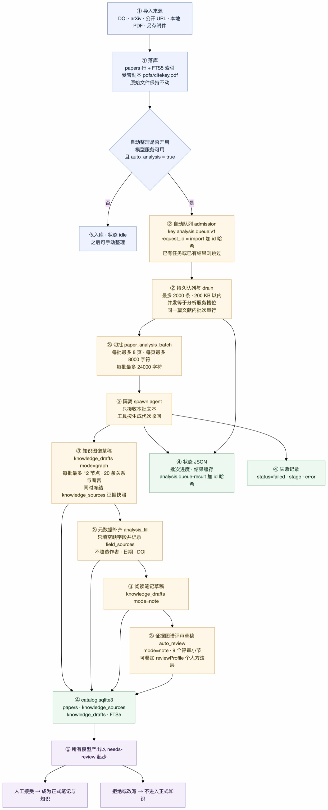
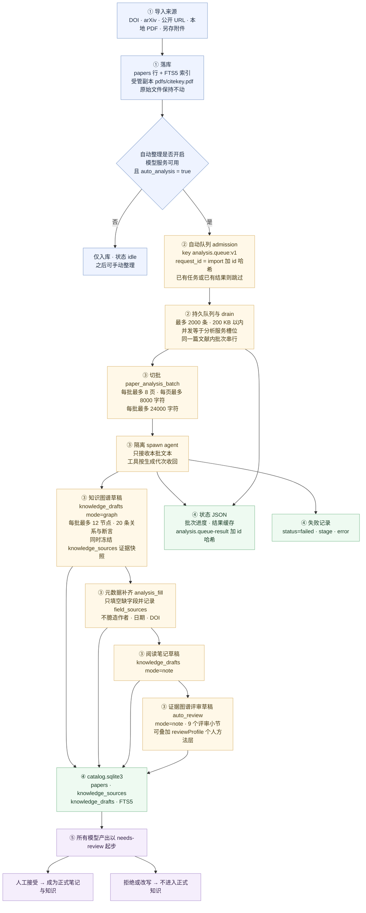
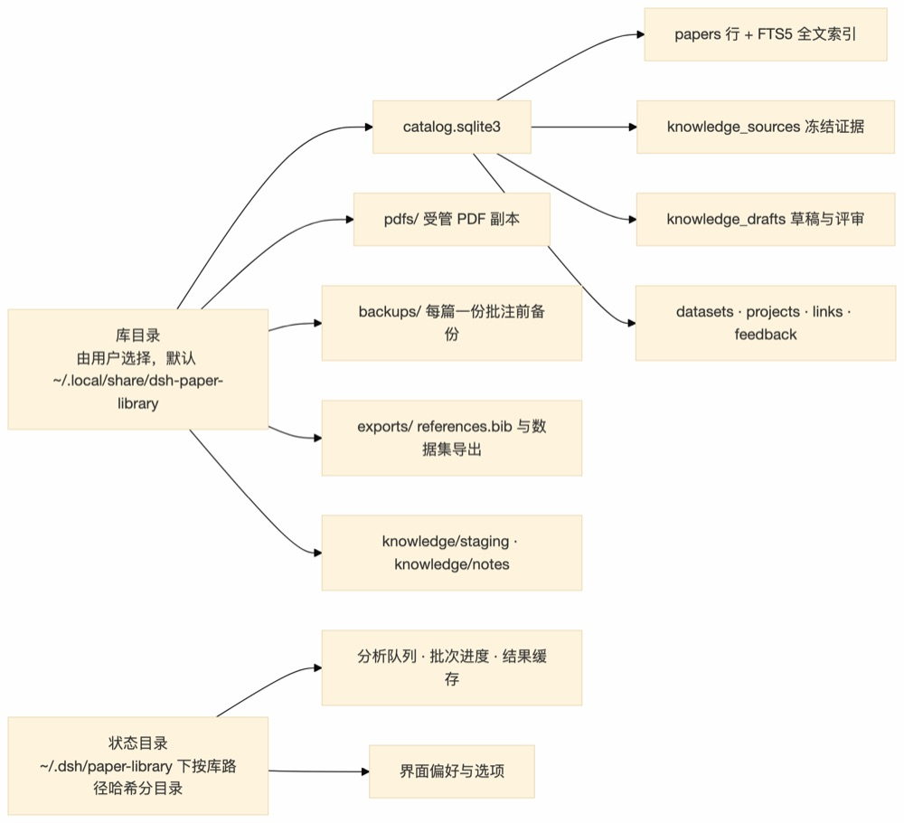
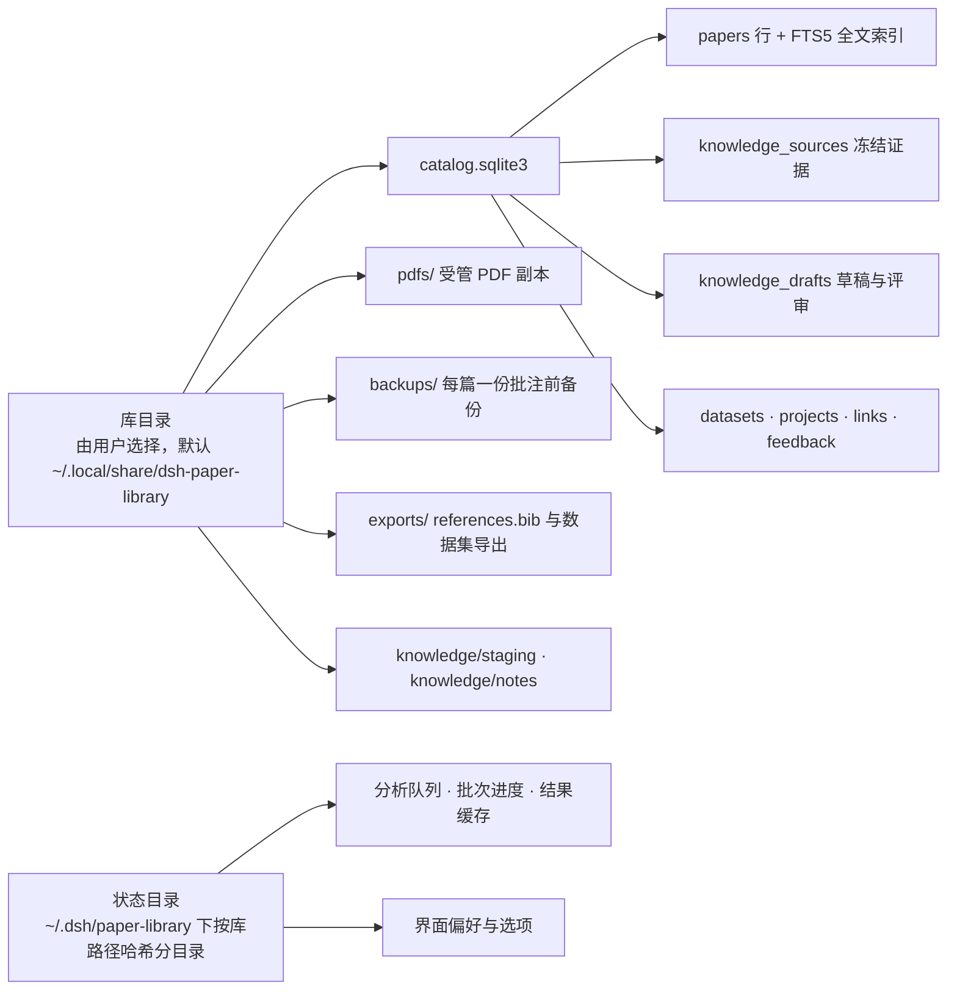

# 文献落库后的自动解析流程与数据产出

本文描述「文献进入 Paper Library 之后会发生什么」：一次导入触发的自动整理（auto analysis）、
每个阶段写下的数据、这些数据的存放位置与体积上限，以及什么时候不会自动发生。

图中所有上限都来自代码里的显式预算（`src/dsh_paper_library/paper_analysis.py`、
`src/harness/paper-analysis.mjs`、`src/harness/paper-analysis-queue.mjs`）；体积样例来自
13 页确定性测试 fixture，不是 1000 篇真实文献的实测值。

## 一张图：从导入到草稿

Mermaid 源码（可复制到画板或笔记）

## 存放位置

Mermaid 源码（可复制到画板或笔记）

## 数据产出对照表

| 产出 | 位置 | 内容 | 上限 |
| --- | --- | --- | --- |
| 文献元数据 | `catalog.sqlite3` `papers` | 题录、DOI、状态、标签 | — |
| 检索索引 | `catalog.sqlite3` FTS5 | 题录与已解析文本的全文检索 | — |
| 受管 PDF | `pdfs/` | 导入时的副本，自动重命名 | 与源文件等大 |
| 批注前备份 | `backups/<id>.pdf.bak` | 每篇一份，写入前生成、成功后覆盖 | 与 PDF 同量级 |
| 证据快照 `knowledge_sources` | `catalog.sqlite3` | 冻结的原文片段与真实页码 | 每批 ≤8 条 · 每条 ≤8,000 字符 · 每批 ≤24,000 字符 |
| 图谱草稿 `knowledge_drafts(mode=graph)` | `catalog.sqlite3` | 节点、关系、断言 JSON | 每批 ≤12 节点 · ≤20 关系与断言 · body ≤64,000 字符 · payload ≤200,000 字节 |
| 阅读笔记草稿 `knowledge_drafts(mode=note)` | `catalog.sqlite3` | 可追溯的 Markdown 笔记 | 样例约 0.75 KB/篇 |
| 评审草稿 `knowledge_drafts(mode=note)` | `catalog.sqlite3` | 9 节证据图谱评审 | 样例约 1.2 KB/篇 |
| 运行状态 | `~/.dsh/paper-library/<sha256>/*.json` | 队列、批次进度、结果缓存、偏好 | 队列 ≤2,000 条且 ≤200 KB · 单条状态 ≤256 KiB |
| 导出 | `exports/` | `references.bib`、CSV、Markdown、BibTeX | 手动触发 |

图谱草稿是节点与关系的唯一来源；阅读笔记和评审草稿都是 `mode=note`，不贡献节点与边。

## 分批预算（每篇文献）

| 参数 | 值 |
| --- | --- |
| `MAX_PAGES` | 8 页/批 |
| `DEFAULT_PAGES` | 3 页（未指定时） |
| `MAX_PAGE_CHARACTERS` | 8,000 字符/页 |
| `MAX_CHARACTERS` | 24,000 字符/批 |

设一篇文献共 P 页、批数 B = ⌈P / 8⌉，则上限为：节点 ≤ 12B、关系与断言 ≤ 20B、
证据快照 ≤ 8B。一篇 20 页文献最多 3 批，即 ≤36 节点、≤60 条关系与断言。

## 什么时候不会自动发生

- `auto_analysis = false`，或模型服务不可用：文献正常入库，整理停留在 idle，可手动开始。
- 该文献已有运行中的整理任务，或已有保存的结果：直接返回现有状态，不重复排队。
- 队列超过 2000 条或 200 KB：本次不再入队并给出提示，文献本身已经保存。
- 宿主重启：只从队列记录恢复；无法确认是否完成的生成会被移除而不是重放。
- `analysis_fill = false`：跳过元数据补齐，其余阶段照常。
- `auto_review = false`：跳过证据图谱评审草稿，图谱与笔记照常。

## 不属于自动流程的相邻功能

以下都需要人明确发起，不在导入触发的链路上：

- 研究难点挖掘 P1–P4：`challenge_scan` → 抽取 → 主题汇总与合并 → 校验、对比与导出。
- 阅读器批注：以标准 PDF 对象写回，读取时直接从 PDF 还原，不依赖目录行。
- 知识工作流：`knowledge source_put` / `draft_put` 建立可审核的证据与关系草稿。
- 导出与引用：`references.bib`、CSL 引用、数据集导出。
- 白板、项目、数据集与文献关联：各自独立的写入路径。
