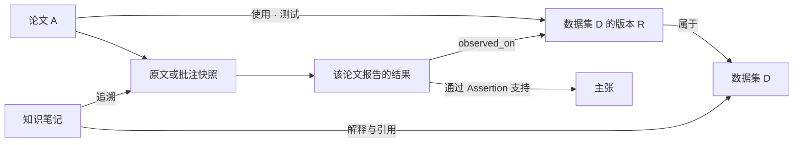

# 文献、数据集与知识笔记：统一库设计评估

2026-09-15。状态：**设计提案，尚未实现**。依据当前提交 `83c162d`、两个 skill 的实际契约及官方引用标准；本轮未修改运行代码、迁移用户资料或调用模型。

## 1. 结论与使用目标

可以把界面中的「文献库」升级为「库」，容纳独立的文献与数据集条目。数据集应能独立登记、检索、引用和查看使用它的论文。知识笔记解释对象和使用边界，图谱记录对象之间有依据的关系。

核心任务是：阅读论文时登记它使用的数据，回到数据集时找到具体使用方式及原文，再据此选择可用的数据和引用。沿用本项目独立于 Zotero、主机本地持久化、按需处理和 DSH 模型服务的约束。用户约 2,000 条文献、1,000 个 PDF 的规模是已有设计输入；数据集数量与大小尚未知。

本轮建议先实现**独立数据集条目、版本、论文关联和有限预览**，再接入知识编码与笔记工作流。大规模数据清洗、训练、全库自动抽取、常驻向量检索和完整 GIS 工作台不在第一阶段。

## 2. 当前代码能复用什么

| 已核对能力 | 可以复用 | 仍缺少什么 |
|---|---|---|
| [磁盘目录](../src/dsh_paper_library/core.py)使用 SQLite、FTS5 和短时 worker | 分页、排序、检索、回收站、导入检查点 | 目录以 `papers` 为中心；数据集字段、跨类型标识和查询尚未建立 |
| [现有图谱](../src/dsh_paper_library/knowledge_graph.py)有 `dataset` 节点 | 节点编辑、方向关系、原文与页码、有限子图 | 节点必须有 `paper_id`，关系限定在该论文图中；同名节点不是共享数据集 |
| [引用模块](../src/citations.mjs)使用 CSL 和 Citation.js | APA、CSL JSON、BibLaTeX 格式化 | 需补数据集及版本引用的完整往返验证；不能因底层支持某类型就宣称产品已支持 |
| [本地状态](../src/local-state.mjs)与 [论文会话](../src/harness/paper-chat.mjs) | 主机落盘、并发冲突保护、原生模型与会话 | 当前会话身份和来源解析针对论文；数据集上下文需要新的类型适配 |
| [技能注册](../src/harness/skills.mjs)已提供独立的 `paper-library-fetch` | 按需注册项目技能，不安装常驻服务 | 目前只注册这一项；知识图谱和知识笔记 skill 尚未打包 |

当前图谱是阅读辅助图，不等于 Research Knowledge OS 的完整语义图。现有 `supports` 关系和附带的引文，尚不足以代替其 Evidence、Observation、Assertion、Claim 契约。

代码检查发现两个必须在接入前处理的具体问题：

- `core.py` 的 `csl_item()` 将 `version` 无条件当作导入系统字段删除，会丢掉合法的数据集版本。Zotero 类型转换、RIS 类型转换和在线补全白名单也未完整覆盖数据集；需要按输入格式区分系统修订号与数据发布版本。
- 现有界面打开条目时会走论文冷会话，表格提供「阅读／附加 PDF」，图谱把目录条目投影成 `paper`。仅把 CSL `type` 改为 `dataset` 会得到一篇缺 PDF 的论文；必须增加独立的对象类型路由。

## 3. 对象、版本与引用身份

建议保留四种不同对象；前三种在一个数据集详情页中呈现，不要求用户维护四张表。

| 对象 | 记录内容 | 身份规则 |
|---|---|---|
| 文献 Paper | 论文、报告、数据论文等引用元数据与 PDF | 保留现有 ID、引用键和会话身份 |
| 数据集 Dataset | 数据系列名称、发布者、主题、官方入口、别名 | 独立稳定 ID；无 DOI、未下载也能建立 |
| 数据版本 DatasetRelease | 明确版本／发布批次、覆盖范围、发布日期、许可、引用信息 | 属于一个数据集；未知版本保持未知，不默认绑定最新版 |
| 数据文件 Asset | 某版本的文件或外部目录、格式、大小、已计算的哈希、获取时间 | 文件名／下载时间不等于官方版本；本地子集记录来源与处理说明 |

动态 API、持续更新的门户可以登记为数据集，不强造固定版本。实际获取时另记快照时间、查询条件和提供方标识；只有真正读取并校验的文件才写入校验值。论文使用的时间／地区子集属于那次使用记录，不覆盖整个数据集的范围。

**引用元数据只维护一份，但权威来源换成插件自身的目录。** Zotero 是可选导入来源；导入保留已有 citekey、来源标识和冲突信息，不建立运行时依赖，也不回写 Zotero。

- 数据集或特定版本可以直接拥有 CSL `dataset` 引用记录和稳定 citekey。数据集系列、版本与介绍论文的 DOI 分别存放。
- 介绍／发布数据集的论文作为关联文献。官方推荐引用可以包含数据本身、技术报告或多篇论文，并记录推荐来源；不强制每个数据集必须有一篇「规范论文」。
- 无 DOI 或引用字段尚不完整不阻止登记；导出时明确缺项，绝不补造作者、年份或 DOI。笔记和关系保存 ID／citekey，不再手写第二份作者年份期刊。
- 数据版本引用优先保留实际使用版本；没有证据时只关联系列，并显示「版本未说明」。引用键变更须有别名解析／迁移，不改变对象或会话 ID。

CSL 已定义 `dataset` 类型；BibLaTeX 提供 `@dataset` 及版本字段。DataCite 区分描述、引用、版本和派生关系。这些标准支持上述设计，但不证明某篇论文实际使用过数据。[CSL 规范](https://docs.citationstyles.org/en/stable/specification.html)、[BibLaTeX 手册](https://tug.ctan.org/macros/latex/contrib/biblatex/doc/biblatex.pdf)、[DataCite 关系说明](https://support.datacite.org/docs/connecting-to-works)。

## 4. 论文如何关联数据集

每条关联保存一个论文、一种关系、一个数据集或明确版本；附带使用角色和证据，避免两组平行列表无法一一对应。

| 界面关系 | 含义 | 不应自动推断的内容 |
|---|---|---|
| 提及 `mentions` | 文中出现这个数据集 | 不等于使用或引用 |
| 引用 `cites` | 文献引用了数据记录 | 不等于用于实验 |
| 使用 `uses` | 实际使用；角色可为训练、验证、测试、案例或其他／未说明 | 不从相同主题或共现推断使用 |
| 发布 `produces` | 论文报告新建／发布了数据 | 不等于所有作者均为长期维护者 |
| 介绍 `describes` | 数据论文、说明报告等 | 不自动成为唯一推荐引用 |

关联建议包含：`paper_id`、`dataset_id`、可空 `release_id`、`relation`、`role`、使用范围／子集、`evidence_ref`、来源种类、标注者、审阅状态与修订号。角色属于一次使用的上下文，不复制数据集实体；同一版本可同时承担多种角色。

证据可以指向论文的已保存批注／原文片段，或官方说明的固定摘录。保存原文、已知 PDF 页码／印刷页码／章节、来源身份、内容哈希和核对时间；缺失位置留空。PDF 中可编辑批注仍是批注的权威来源，图谱证据只冻结某次引用内容。批注修改或删除后显示「来源已变化」，不改写旧证据。

AI 可以从当前选择的批注提出候选数据集和关系。候选起始为待审阅；用户确认时查看原文、版本和角色。系统不把字符串匹配、模型自信程度或元数据 API 的关联升级为「已核验使用」。手工无来源的关联也可保留为待核对记录。

反向页面由查询生成：已核对的使用论文、候选关联、仅提及和数据说明分别显示。总数按不同论文 ID 去重，标明统计范围；「0 条已核对使用」不能解释为没有人使用。

## 5. 浏览与低成本登记

顶部沿用 DSH 主题和紧凑工具栏；「库」的类型过滤为「全部／文献／数据集」。扩展表格依对象类型更换字段，而非让数据集占用作者、期刊、JCR 等无意义列。

```text
库   检索…   全部 | 文献 | 数据集                     ＋ 添加
├─ 紧凑列表／展开表格
└─ 选中文献：现有 PDF、批注、论文对话、关联数据集
   选中数据集：概览 | 版本与文件 | 相关论文 | 知识笔记
              名称／发布者／范围／许可／可用状态
              当前版本与引用方式
              资料编辑／连接文件／预览／引用／对话
```

阅读 PDF 时仍然只有一条「库／批注」共享侧栏。库里选中数据集可以先看简要详情或关联面板，显式「打开数据集」再切换主区；返回论文保留页码、未保存批注与问题草稿。数据集主区不显示 PDF 页码、标注工具或 JCR。数据集对话同样按需使用原生 DSH 会话，不因列表扫描启动 Agent。

登记深度与下载状态分开：

| 深度 | 最小工作量 | 升级依据 |
|---|---|---|
| 登记 L0 | 名称、链接或来源、一句内容说明；未知项留空 | 遇到即可记，不生成长笔记或调用模型 |
| 建档 L1 | 发布者、获取方式、许可状态、版本／范围、引用入口 | 打算使用或进一步调查；许可未知可存，但醒目标记 |
| 核验 L2 | 字段／单位、覆盖与缺失、处理或实验记录、核验来源与日期 | 明确哪些性质被检查过；下载成功或有一篇引用论文不自动升级 |

状态另存「只有入口／已连接文件／已下载／文件缺失」和「待核对／已核对／来源变化」，不把下载、知识完整性和数据质量混为一个 `active` 标签。总览由目录查询生成；导出的 Markdown 表和 CSV 是视图。

第一阶段的「浏览数据」范围：文件清单、字段和少量行。先支持 CSV／TSV／JSONL 的显式预览；复杂二进制、压缩包、Parquet、GeoPackage、影像等先显示格式、大小和打开入口，后续再加专用按需读取器。采样的类型、范围和计数标为估计，不冒充全文件统计。

粘贴链接先归档数据集资料和来源，不自动下载可能很大的数据包。连接已有路径与复制进管理目录是明确的两种文件操作；浏览器上传以流落盘。文件移动后允许重新定位，不能仅凭同名文件绑定。登记、读取元数据和图谱查询都不打开原始数据文件。

## 6. 两个 skill 如何融入

### Research Knowledge OS：可查询、有证据的关系

当前 v3 已有 Dataset、Method、Metric、Task、Evidence、Figure、Formula、Observation、Assertion、Claim 等类型。其重要规则是独立稳定身份、原子关系、来源定位、文献事实与作者／AI 判断分离，以及先编码后 lint。

复用这些规则，把「论文使用数据」「结果来自哪份数据」「证据支持哪个主张」分开。例如以下是结构示意，不代表真实研究事实：



结构关系使用 Edge；Evidence／Figure／Formula／Observation 对 Claim／Gap 的认识关系使用 Assertion。用户自己的想法与模型建议保持区别；验证程序只做类型、引用、重复和完整性检查，不负责宣布科学结论成立。

原 RKOS 校验器仅强制部分 AI 记录待审：中低置信 Assertion 必须 `needs-review`，高置信 AI Assertion 可以是 `accepted`，省略状态时默认 `accepted`。因此「所有新 AI 判断先待审」必须由插件工作流额外落实，不能依赖原 lint 自动保证。`knowledge-note` 的标题／来源计数检查也不证明正文事实成立。

**适配边界：**原 skill 的 Zotero/Better BibTeX 只读入口、整个临时图加载、作者私有目录及 APA Bridge 路径，不能原样成为本插件运行时。本插件使用自己的目录和 CSL 引擎；本地旧 sidecar 只能按用户选择导入，预览差异后写入插件，保留来源哈希及外部 ID，不后台双向同步。

原 CLI 还会自动加入技能自带的专家注册表，并在缺少明确输入时发现 Wiki 文件。插件只能读取明确选择的资料和受限依赖；使用独立适配器或显式输入的核心模块，不启动原 CLI 的自动发现和默认 APA Bridge 路径。

建议建立版本化 `rkos-v3` 适配器和稳定 ID 映射。导出时查询需要的子图与依赖闭包，限制节点、字节和耗时，在短时 worker 中执行 lint。边界过大时显式停止或让用户缩小范围，不能一边截断一边声称是完整图。

APA／BibLaTeX 继续只负责引用。完整的库导入导出还需版本化 Library JSON 包，保存实体、版本、关系、来源、笔记清单和外部 ID 映射；RKOS v3 兼容子集不能承担无损备份。多个来源可以支持同一关系，应通过独立证据关联保存，不被现有的「同端点＋同关系唯一」规则覆盖。

版本、文件、使用角色和本地来源快照并非现有 v3 的完整模型。插件可在目录中保留扩展字段，但对外必须给出映射与损失报告；缺少对应语义的关系不能改叫 `uses` 来蒙混通过。原 skill 尚未接入前，也不能把旧阅读图宣称为 RKOS 合规图。

特别区分两个同名语法：引用文件里的 BibLaTeX `@dataset` 与 `*.knowledge.bib` 中的 RKOS `@dataset`。后者是带 `@graph` manifest 的解析专用格式，不可交给 biber；前者是数据集的引用记录。适配器必须按文件角色、schema 和命名空间识别，不能靠后缀或 `@dataset` 字样判断。

这不是假设风险：当前 `ResearchGraph.build()` 从 bibliography 排除所有知识类型，而 `dataset` 正是知识类型，所以 `--bib` 中合法的 `@dataset` 会被静默排除，且不会转入图节点。原来源链也仅解析 Paper citekey。原版 v3 因此不能完整接收数据集直接引用／原生来源。适配器必须显式支持扩展源类型，或拒绝／报告不支持项；不能伪造一篇论文来承接数据集来源。

### Knowledge Note：把数据说明写成人能理解的知识

保留 source digest → 可读知识页 → 按需综合比较的工作流。数据集知识页回答：它包含什么、记录单位是什么、覆盖哪些时空范围、怎样获得与解释、适合什么任务、与替代数据差别何在、有哪些许可和证据限制。

L0 只登记条目；L1 可开始简短说明；需要形成完整知识页时才使用 `knowledge-note` 的定义、具体例子、机制、发展、替代方案、上下游、用途与限制等阅读契约。历史信息不足就标明未核验，不为了填标题让模型编造。跨数据集比较仅在需要做选择时建立。

知识页正文保存为 Markdown；通过对象 ID、来源 ID、图谱节点 ID 和 citekey 引用，题名作者等由目录渲染。结构化字段和关系归目录，长解释归 Markdown；生成的导航、反向引用和来源数量不手工维护。一个来源摘录可被多个笔记复用，不为每一篇相关论文重复整页资料。

建议提供独立项目技能 `paper-library-knowledge` 和 `paper-library-notes`，保持原 skill 名称可用于其原工作区。入口是插件工具、条目或明确选择的批注，产出是可审阅的变更草稿；技能复用当前 DSH 模型，不另存模型密钥。最终写入交给插件的校验／持久化 API，不能让模型任意编辑目录文件。

打包前需记录所采用文件、源版本／哈希和许可；保留第三方归属，不复制私有专家资料、笔记或 skill 质量事件。当前只是契约适配提案，两个新 skill 尚未注册，也未修改个人 canonical skill。

## 7. 本地存储与内存边界

沿用现有 SQLite 目录作为结构化权威存储。此前「不要数据库」是手工 Markdown 笔记场景的建议，不适用于已经提供排序、并发编辑与关系查询的插件。磁盘目录不要求将全库载入内存；已有 FTS 缓存预算为 2 MiB，但这不是应用总内存上限。

| 内容 | 权威位置 | 读取方式 |
|---|---|---|
| 文献、数据集、版本、文件登记、关系与结构化知识 | 配置的资料库目录中的 SQLite | 分页、定向邻接查询、事务和修订号 |
| 用户批注 | 管理副本 PDF | 只在读当前论文／指定批注时解析 |
| 知识正文与来源摘录 | 资料库中的独立 Markdown／固定快照文件 | 按对象加载；安全渲染，不执行文档脚本 |
| 原始数据文件 | 用户选择的文件位置或管理目录 | 默认不打开；预览或验证时启动受限 worker |
| 草稿、偏好、阅读状态 | 现有 DSH-home 私有状态目录 | 复用 CAS、原子写入与冲突恢复 |
| 论文／数据集对话 | DSH 原生会话持久化 | 可见时查询有限历史；明确发送才调用模型 |
| FTS、预览统计、Markdown 总览、CSV、RKOS 导出 | 可重建的派生文件或索引 | 按需生成，保留源修订／时间 |

不使用 localStorage、IndexedDB 或浏览器缓存保存内容。换浏览器后，通过同一 DSH 服务读取同一份状态；这与模型是否在本地推理是两件事。上一轮指出的独立预览页未连接 DSH 模型后端仍是单独待实现项。

新增预览的起始预算建议为 100 行、50 列、512 KiB 响应；输入读取字节、单字段长度、解析时间和 worker RSS 还要独立设限，以合成大文件验证后定值。读取器需要能取消、报部分结果和释放内存，不能先整文件载入再截取前 100 行。一次仅运行一个数据预览任务；PDF 继续沿用最多三页驻留机制。

全文／数据内容索引、后台文件扫描、向量模型和全库语义图不随本功能启动。知识检索先用 ID／DOI／citekey、元数据和笔记 FTS；只读取当前候选或选中条目的具体来源。AI 来源材料必须显式选择并有总字节预算，不默认发送整个文件或数据目录。

跨 SQLite 与 Markdown／快照文件的写入需要恢复协议：先写暂存文件及清单，再以事务登记确认，失败保留可恢复状态；收到成功回执后才显示「已保存」。备份应同时覆盖目录、已管理文件、笔记及状态，外部链接只备份清单并明确提示，不声称完整离线备份。

## 8. 分阶段实施与兼容性

| 阶段 | 工作 | 完成标准 |
|---|---|---|
| A：可用的数据集库 | 数据集／版本／文件登记、统一列表、引用、双向论文关联、来源与状态 | 可完成登记 → 阅读论文关联 → 数据集反查原文 → 导出引用；刷新／换浏览器保持一致 |
| B：有限数据浏览 | 文件清单、字段与有预算的 CSV／TSV／JSONL 预览、缺失文件恢复 | 大文件、超长行、取消和异常编码不造成无限内存占用或误报全量统计 |
| C：知识工作流 | 两个项目技能、知识正文、typed Edge／Assertion、待审阅候选、RKOS 适配 | 依据所选批注建有来源的草稿；确认后可查询；导出 lint 和损失报告均可读 |

阶段 A 应为当前目录做**增量迁移**：新增独立数据集相关表和共用标识／引用键登记，不把所有文献 ID 重建为新 `resource_id`。旧 Paper API、PDF 引用 token、保存快照和会话命名保持兼容；新统一列表可以经适配器组合不同实体。

旧的论文内 `dataset` 节点保留原身份。提供「关联已有数据集／提升为独立条目」的可审阅操作，保存映射；同名节点只作为候选，不自动合并。旧 `supports` 边不能无条件迁移成已核验 Assertion。重复导入、半途失败和回收站／恢复必须保留这些映射，引用悬空时明确报出。

实现前需要细化的工程选择：数据库 schema 版本与唯一键范围、跨文件提交恢复、RKOS 文件角色映射、citekey 改名策略、预览解析器和实测预算。它们是实现设计项；数据集能否成为独立对象的结论不依赖这些细节。

## 9. 验证计划与本轮证据边界

后续实现以合成数据验证：

1. 一个数据集被两篇论文使用，版本和角色不同；双向查询准确且无重复条目。
2. 同名不同数据集、系列 DOI／版本 DOI／数据论文 DOI、无 DOI、未知版本不误合并。
3. 提及、引用、待审阅和已核对使用分开；原文位置未知不造页码，批注变动可追踪。
4. APA、CSL JSON、BibLaTeX 数据集引用保留版本、DOI、机构作者和 citekey；旧论文输出回归通过。
5. RKOS 的 bibliographic `@dataset` 与 graph `@dataset` 分流；不支持的类型／关系提供损失报告而不是静默省略。没有关联论文时，DatasetRelease 的官方固定摘录 → Evidence → Claim 仍保持数据集来源身份；这属于扩展能力，不冒充原版 v3 支持。
6. 图谱、Markdown、快照的并发写入／中断可恢复；原始文件不修改，刷新／第二个浏览器可读。
7. 大文件预览有输入和输出预算，采样不冒充全量；关闭后 worker 退出，后台不扫描库。
8. 旧论文会话、PDF 批注、引用快照、共享侧栏和主题保持；新数据集不会激活全库 Agent。
9. 高置信 AI 判断或省略状态的模型输出仍进入待审阅区；独立证据不因同一关系去重丢失，完整 Library JSON 恢复保留版本和来源映射。

本轮完成的是源代码和契约评估，以及这份提案的交叉审查。已有容量测试只覆盖文献和小型合成 PDF；没有测量加入数据集后的总内存，没有执行数据导入、数据预览、两项新 skill 或真实数据集用户测试。

来源核对：`research-knowledge-os` SKILL SHA-256 `d8d440d75adff009d98635ae34431307193784c7003e45af800a8400e8c0c5be`，其 `research-graph-schema.md` v3；`knowledge-note` SKILL SHA-256 `b317f9a72c499c4d3fc0ca486bc4fa6268227a23523537ed16843441b0854fd9`，其 `readable-knowledge-page.md`。上述为本次所读源版本，不表示已经取得整包再发布许可或已经完成打包。
